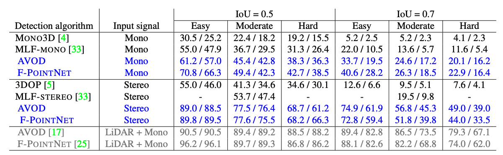

# coding-template

## Summary

The summary can contain but is not limited to:

- Code structure.

- Commands to reproduce your experiments.

- Write-up of your findings and conclusions.

- Ipython notebooks can be organized in `notebooks`.

## Reference

For the coding related to the Pseudo-LiDAR paper, I referenced code from the author's Github repo: https://github.com/mileyan/pseudo_lidar

## Psuedo-LiDAR from Visual Depth Estimation

### Model and Dataset

I tried to replicate the study presented in the paper by training a stereo depth estimator and 3D object detector usign the KITTI object detection benchmark. The needed parts of the dataset were the left color images, right color images, Velodyne point clouds, camera calibration matrices, and training labels. 

The authors provide a pretrained PSMNet model using the Scene Flow dataset that was trained on 3,712 training images of the KITTI detection benchmark. Unfortunately, I was unable to use their pretrained model as multiple computers were unable to successfully extract the file for the model from its compressed format. I was unable to find the model on other websites. 

I attempted to train my own model but did not have enough space on my computer for all of the required data. The uncompressed size of all the data was over 100GB. Using Google Colab was not working either as I didn't have enough space on my Google Drive to store all the data either. I attempted to use a subset of the data, but could not get a model to train successfully due to compute limitations. However, I will present my attempt as well as the results that the authors received in the paper. 

### Code

The first step was to train a stereo disparity model. The authors suggested training PSMNet, so I followed that suggestion. The authors suggested training it on 300 epochs, but I selected 20. However, I could not get this step to train correctly. The authors used 4 Titan X GPUs and I had a single RTX 480 GPU. From there, the next step was to predict the disparities using the model and convert the disparities to point clouds as well as generate ground planes for 3D object detection. This was essentially to prepare the data. The authors then linked two different 3D object detection models (AVOD, Frustum-PointNets) which had pretrained models. However, as I was unable to complete the previous step, I did not see the point in investigating these models further. 

### Results
Here I have included the results from the paper as I was unable to get the code working

### Analysis

In terms of analysis, I can truly only comment on the quality of the provide code and ease of implementation rather than performance, training speed, difference between experiments, etc. The authors presented very easy to follow instructions on how to train and set up the data for various parts of the training and inference pipeline. The difficult part of the KITTI dataset was that I had to download and organize multiple folders of data as there was input data of different mediums. 