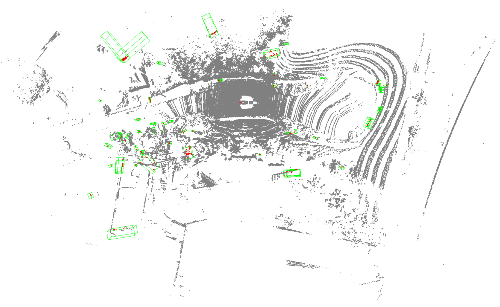
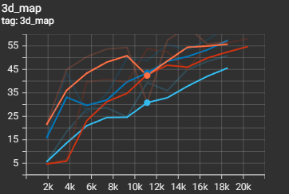
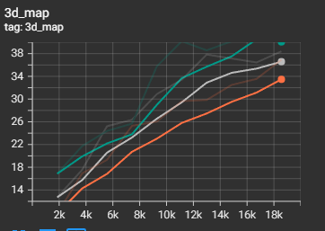

# Coding Assignment Week 11 Group 2


## PointRCNN: 3D Object Proposal Generation and Detection from Point Cloud

### Model and Dataset

The PointRCNN object detector directly generates 3D bounding box proposals from raw point cloud data.
I used the code referenced in the paper: https://github.com/sshaoshuai/PointRCNN

As in the paper, I evaluated the PointRCNN model on the 3D object detection benchmark of KITTI. The 3D object detection benchmark contains 7481 training samples and 7518 testing samples. The paper divides the training samples into the train split (3712 samples) and the val split (3769 samples). I evaluate the object detector on the car category.

### Code

First, I cloned the code repository mentioned in the paper:

```shell
git clone --recursive https://github.com/sshaoshuai/PointRCNN.git
```

I changed the gcc version to 5.0, the torch version to 1.0.0, and the torchvision version to 0.2.1:

```shell
sudo apt install g++-5
sudo apt install gcc-5
sudo update-alternatives --install /usr/bin/gcc gcc /usr/bin/gcc-5 10
sudo update-alternatives --install /usr/bin/gcc gcc /usr/bin/gcc-5 20
sudo update-alternatives --install /usr/bin/g++ g++ /usr/bin/g++-5 10
sudo update-alternatives --install /usr/bin/g++ g++ /usr/bin/g++-5 20
sudo update-alternatives --install /usr/bin/cc cc /usr/bin/gcc 30
sudo update-alternatives --set cc /usr/bin/gcc
sudo update-alternatives --install /usr/bin/c++ c++ /usr/bin/g++ 30
sudo update-alternatives --set c++ /usr/bin/g++
pip install torch==1.0.0 torchvision==0.2.1
```

I installed easydict, tqdm, tensorboardX, and ninja:

```shell
pip install easydict
pip install tqdm
pip install tensorboardX
pip install ninja
```

I built and installed the pointnet2_lib, iou3d, roipool3d libraries:

```shell
sh build_and_install.sh
```

I downloaded and organized the KITTI object detection dataset as indicated in the code repository:

```shell
PointRCNN
├── data
│   ├── KITTI
│   │   ├── ImageSets
│   │   ├── object
│   │   │   ├──training
│   │   │      ├──calib & velodyne & label_2 & image_2 & (optional: planes)
│   │   │   ├──testing
│   │   │      ├──calib & velodyne & image_2
├── lib
├── pointnet2_lib
├── tools
```
```shell
wget https://s3.eu-central-1.amazonaws.com/avg-kitti/data_object_velodyne.zip
wget https://s3.eu-central-1.amazonaws.com/avg-kitti/data_object_calib.zip
wget https://s3.eu-central-1.amazonaws.com/avg-kitti/data_object_label_2.zip
wget https://s3.eu-central-1.amazonaws.com/avg-kitti/data_object_image_2.zip
```

I downloaded the PointRCNN object detector model:
```shell
wget https://drive.google.com/file/d/1aapMXBkSn5c5hNTDdRNI74Ptxfny7PuC/view?usp=sharing
```

Finally, I evaluated the model on the car category of the KITTI object detection dataset:
```shell
python eval_rcnn.py --cfg_file cfgs/default.yaml --ckpt PointRCNN.pth --batch_size 1 --eval_mode rcnn --set RPN.LOC_XZ_FINE False
```

### Results

I measure the average precision of object detection on the car category of the KITTI dataset. I measure the avverage precision of achieving a minimum IOU of 0.7 on easy, medium, and hard difficulty samples. Precision is the number of true positives divided by the sum of true positives and false positives.
I measure bbox (the 2D accuracy of the detection frame), bev (the accuracy of the detection box in view), 3d (the accuracy of the detection frame), and aos (the accuracy of the detection target rotation angle).

|      | Easy | Medium | Hard  |
|------|------|--------|-------|
| bbox | 96.9 | 89.5   | 88.7  |
| bev  | 90.2 | 87.9   | 85.5  |
| 3d   | 89.2 | 78.9   | 77.9  |
| aos  | 96.9 | 89.4   | 88.6  |

I also measure the total bounding box recall and the total region of interest bounding box recall. Recall is the number of true positives divided by the sum of true positives and false negatives. I measure recall accross mutliple IOU thresholds (0.1, 0.3, 0.5, 0.7, 0.9).

|                 | 0.1   | 0.3   | 0.5   | 0.7   | 0.9   |
|-----------------|-------|-------|-------|-------|-------|
| bbox recall     | 0.95  | 0.94  | 0.93  | 0.70  | 0.00  |
| roi bbox recall | 0.95  | 0.94  | 0.93  | 0.83  | 0.16  |


## Psuedo-LiDAR from Visual Depth Estimation

## Reference

For the coding related to the Pseudo-LiDAR paper, I referenced code from the author's Github repo: https://github.com/mileyan/pseudo_lidar

### Model and Dataset

I tried to replicate the study presented in the paper by training a stereo depth estimator and 3D object detector usign the KITTI object detection benchmark. The needed parts of the dataset were the left color images, right color images, Velodyne point clouds, camera calibration matrices, and training labels. 

The authors provide a pretrained PSMNet model using the Scene Flow dataset that was trained on 3,712 training images of the KITTI detection benchmark. Unfortunately, I was unable to use their pretrained model as multiple computers were unable to successfully extract the file for the model from its compressed format. I was unable to find the model on other websites. 

I attempted to train my own model but did not have enough space on my computer for all of the required data. The uncompressed size of all the data was over 100GB. Using Google Colab was not working either as I didn't have enough space on my Google Drive to store all the data either. I attempted to use a subset of the data, but could not get a model to train successfully due to compute limitations. However, I will present my attempt as well as the results that the authors received in the paper. 

### Code

The first step was to train a stereo disparity model. The authors suggested training PSMNet, so I followed that suggestion. The authors suggested training it on 300 epochs, but I selected 20. However, I could not get this step to train correctly. The authors used 4 Titan X GPUs and I had a single RTX 480 GPU. From there, the next step was to predict the disparities using the model and convert the disparities to point clouds as well as generate ground planes for 3D object detection. This was essentially to prepare the data. The authors then linked two different 3D object detection models (AVOD, Frustum-PointNets) which had pretrained models. However, as I was unable to complete the previous step, I did not see the point in investigating these models further. 

### Results
Here I have included the results from the paper as I was unable to get the code working


### Analysis

In terms of analysis, I can truly only comment on the quality of the provide code and ease of implementation rather than performance, training speed, difference between experiments, etc. The authors presented very easy to follow instructions on how to train and set up the data for various parts of the training and inference pipeline. The difficult part of the KITTI dataset was that I had to download and organize multiple folders of data as there was input data of different mediums. 


## Center-based 3D Object Detection and Tracking

### Model and Dataset

**Dataset:** The nuScenes dataset is a public large-scale dataset for autonomous driving developed by the team at [Motional](https://www.motional.com/) (formerly nuTonomy). The dataset covers 1000 driving scenes in Boston and Singapore, two cities that are known for their dense traffic and highly challenging driving situations. Specifically, the dataset is splitted by 700, 150, 150 sequences for training, validation, and testing, respectively. Each sequence is approximately 20-second long, with a Lidar frequency of 20 FPS.


**Model**: CenterPoints - a 3D detector that represent, detect, and track 3D objects while view them as points


### Code

The method is supported in the code base **[mmdetection3d](https://github.com/open-mmlab/mmdetection3d)**. The install instruction can be found in [getting_started.md](https://github.com/open-mmlab/mmdetection3d/blob/master/docs/getting_started.md).

After setup the environment and dataset, we test the model via the following command:

`python tools/test.py configs/centerpoint/centerpoint_0075voxel_second_secfpn_circlenms_4x8_cyclic_20e_nus.py checkpoints/centerpoint_0075voxel_second_secfpn_circlenms_4x8_cyclic_20e_nus_20200925_230905-358fbe3b.pth`


For the visualization, we use the following command:

`python tools/test.py configs/centerpoint/centerpoint_0075voxel_second_secfpn_circlenms_4x8_cyclic_20e_nus.py     checkpoints/centerpoint_0075voxel_second_secfpn_circlenms_4x8_cyclic_20e_nus_20200925_230905-358fbe3b.pth     --eval mAP --eval-options 'show=True' 'out_dir=./data/nuscenes/show_results'`


### Results

| Metric                                | Score  |
| ------------------------------------- | ------ |
| mean Average Precision (mAP)          | 0.5628 |
| mean Average Translation Error (mATE) | 0.2518 |
| mean Average Scale Error (mASE)       | 0.2497 |
| mean Average Orientation Error (mAOE) | 0.3874 |
| mean Average Velocity Error (mAVE)    | 0.3946 |
| mean Average Attribute Error (mAAE)   | 0.1149 |
| nuScenes detection score (NDS)        | 0.6416 |

According to the table, the results evaluated on nuScenes 56.3 and 64.2 in mAP and NDS, respectively. On the other hand, In the official code repository, the results evaluated on nuScenes are 58.0 and 65.5 in mAP and NDS, respectively. By comparing the two results, we concluded that the performance reported in the paper is reproducible by both official repository and third-party library like mmdetection3D.


| Object Class         | AP    |
| -------------------- | ----- |
| car                  | 0.866 |
| truck                | 0.498 |
| bus                  | 0.697 |
| trailer              | 0.212 |
| construction_vehicle | 0.324 |
| pedestrian           | 0.880 |
| motorcycle           | 0.434 |
| bicycle              | 0.483 |
| traffic_cone         | 0.827 |
| barrier              | 0.407 |

According to the per-class results, the best three categories are *car*, *pedestrian*, and *traffic_cone*. We conclud that this is result from the fact that these objects have small variance in the size and shape. Moreover, they are also few of the most common objects in the dataset. On the other hand, the class *trailer* performs the worst. We believe this is because of the complex shape nature of the object class. Note that we only use a subset of the original dataset, thus the class number might be imbalance.





In the paper, they pointed out center-based detectors perform much better than the anchor-based baseline when the box is rotated or deviates from the average box size due to the better ability to capture the rotation and size invariance when detecting objects. As we can see in the visualization, the method is very robust regarding to the object size and rotations, which aligns with their conclusions.


### Difficulties

In this project, we are facing the following difficulties during implementation:

- Dataset size: most of the 3D object detection datasets is relatively large and we cannot apply whole set of them during testing due to the drive space. Accordingly, we only use the train/eval set in the first data split of nuScenes due to the hardware limitation. Thus, the results might be different from what they reported in the paper.
- Dependencies issue: we tried running the official code release here yet failed to solve the dependencies issue. The main reason is that we did not have enough clearance to change/update CUDA version in order to compile the library like `spconv` or other CUDA extensions.

## PointPillars

### Model and Dataset

I used the PointPillars model to perform object detection on the KITTI dataset.
The model was obtained from https://github.com/nutonomy/second.pytorch,
the code the authors used in the paper. The KITTI object detection benchmark
dataset, which is composed of 7481 training and 7518 testing samples, was
prepocessed and prepared using the provided code as well. The authors of the
paper further split this dataset so that the car detections were seperate
from the pedestrian/cyclist detections.

### Code

The code was prepared by following the available instructions on the github.
After cloning the repository packages were intalled as follows:
```bash
conda create -n pointpillars python=3.7 anaconda
source activate pointpillars
conda install shapely pybind11 protobuf scikit-image numba pillow
conda install pytorch torchvision -c pytorch
conda install google-sparsehash -c bioconda
pip install --upgrade pip
pip install fire tensorboardX
git clone git@github.com:facebookresearch/SparseConvNet.git
cd SparseConvNet/
bash build.sh
sudo apt-get install libboost-all-dev
export NUMBAPRO_CUDA_DRIVER=/usr/lib/x86_64-linux-gnu/libcuda.so
export NUMBAPRO_NVVM=/usr/local/cuda/nvvm/lib64/libnvvm.so
export NUMBAPRO_LIBDEVICE=/usr/local/cuda/nvvm/libdevice
```
The python path was also updated to include the the directory
second.pytorch/. The KITTI dataset was downloaded from
http://www.cvlibs.net/datasets/kitti/eval_object.php?obj_benchmark=3d
and was set up into the following structure:

```plain
└── KITTI_DATASET_ROOT
       ├── training    <-- 7481 train data
       |   ├── image_2 <-- for visualization
       |   ├── calib
       |   ├── label_2
       |   ├── velodyne
       |   └── velodyne_reduced <-- empty directory
       └── testing     <-- 7580 test data
           ├── image_2 <-- for visualization
           ├── calib
           ├── velodyne
           └── velodyne_reduced <-- empty directory
```

The data was then processed with

```bash
python create_data.py create_kitti_info_file --data_path=KITTI_DATASET_ROOT
python create_data.py create_reduced_point_cloud --data_path=KITTI_DATASET_ROOT
python create_data.py create_groundtruth_database --data_path=KITTI_DATASET_ROOT
```
And finally the configuration files were modified so that

```bash
train_input_reader: {
  ...
  database_sampler {
    database_info_path: "/path/to/kitti_dbinfos_train.pkl"
    ...
  }
  kitti_info_path: "/path/to/kitti_infos_train.pkl"
  kitti_root_path: "KITTI_DATASET_ROOT"
}
...
eval_input_reader: {
  ...
  kitti_info_path: "/path/to/kitti_infos_val.pkl"
  kitti_root_path: "KITTI_DATASET_ROOT"
}
```
### Experiments

All experiments were run on gcloud VM. An n1-standard-2 machine was used
with a NVIDIA Tesla P4 GPU and a "Deep Learning Image: PyTorch 1.8 m73 CUDA 110"
image. The PointPillars model was trained for 10 epochs on the Cars and
Pedestrian detection tasks with pillar grid sizes of 16, 20, 24, and 28 $$m^2$$

### Results

The MAP from the Car section of the KITTI dataset is shown below.



The light orange has a bin size of 16, the dark blue a bin size of 20, the
red a bin size of 24, and the light blue a bin size of 24. The MAP of the
Pedestrians can be seen below



The pink has a bin size of 16, the dark green a bin size of 20, the
gray a bin size of 24, and the orange a bin size of 24. The rest of
the metrics for these experiments can be viewed on the notebook
in the pointpillars/ directory.

### Analysis

It appears, as mentioned in the paper, that the smaller bin sizes tended to
outperform the larger bin sizes. However, this increased MAP came at a
price of longer training times, as we can observe that the bin size of
16 for the car dataset took almost 30 minutes longer to complete training
than the bin size of 24.
